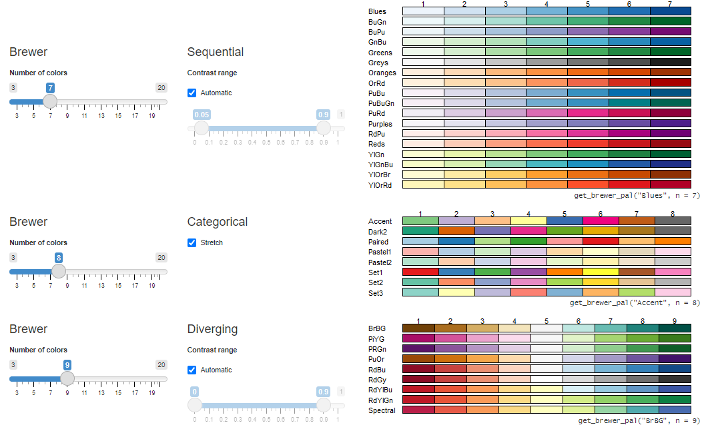

```{r setup, include=FALSE}
knitr::opts_chunk$set(echo = TRUE)
```

## Spatial Data Visualization

In this lesson we will be working with some more advanced mapping and visualization techniques, plotting multiple spatial layers together, and learn how to make these interactive.

First, remember to run your setup script, and also read in all the data you created in the 'get-spatial' lesson.

```{r}
source("setup.R")

#load in all your vector data
load("data/spatdat.RData")

#read in the elevation and landcover rasters
landcover <- terra::rast("data/NLCD_CO.tif")

elevation <- terra::rast("data/elevation.tif")
```

## Mapping with `ggplot2`

Let's start visually exploring our counties data. R has a base `plot()` function which you may have used briefly in previous lessons. If you want to use it to plot `sf` objects, you have to specify the `geometry` column.

```{r}
plot(counties$geometry)
```

You've been using `gpglot2` in Lesson 2 to make nonspatial charts, but this package also has the capability of mapping spatial data, specifically `sf` objects, with the `geom_sf()` function:

```{r}
ggplot(data = counties) +
  geom_sf()
```

Say you want to color counties by their total area of water ('AWATER') variable:

```{r}
ggplot(data = counties, aes(fill = AWATER)) +
  geom_sf()
```

`geom_sf()` interprets the geometry of the sf object and visualizes it with the 'fill' value given.

#### Customizing `ggplot2` maps

Here are some ways to make a more publication ready map:

```{r}
ggplot(data = counties, aes(fill = AWATER)) +
  geom_sf() +
  scale_fill_distiller(palette = "YlGnBu", direction = 1) +
  labs(title = "Total Area of Water in each Colorado County, 2021",
       fill = "Total Area of Water",
       caption = "Data source: 2021 5-year ACS, US Census Bureau") +
  theme_void()
```

You can save `ggplot2` maps/plots either directly from the "Plots" viewing pane or with the `ggsave()` function, which allows for a little more customization in your figure output.

```{r eval=FALSE}
?ggsave
```

## Mapping with `tmap`

We've already been using `tmap` to quickly view our results, but there are also a lot of ways to create custom cartographic products with this package.

Set `tmap_mode()` to "plot" to make static maps.

```{r}
tmap_mode("plot")
```

The general structure of `tmap` maps is to first initialize the map with `tm_shape` supplied with the spatial object, and then the following function depends on what geometry or symbology you want. We are going to first map just our county polygons so will use the `tm_polygons()` function.

```{r}
tm_shape(counties) +
  tm_polygons()
```

We can color polygons by a variable using the `col =` argument:

```{r}
tm_shape(counties) +
  tm_polygons(col = "AWATER")
```

A difference we see between our `tmap` and `ggplot2` maps is that by default `tmap` uses a classified color scheme rather than a continuous once. By default `tmap` sets the classification based on the data range, here choosing intervals of 20 million (i.e, mln).

Given this classified structure, say you also wanted to see the distribution of the raw values:

```{r}
hist(counties$AWATER)
```

We can manually change the classification of our map within the `tm_polygons()` function with the `style =` argument. Let's try using a quantile method, where each class contains the same number of counties. `tm_layout()` also offers a lot of options to customize the map layout. Here we remove the map frame and put the legend outside the map area.

```{r}
tm_shape(counties) +
  tm_polygons(col = "AWATER",
              palette = "Blues",
              style = "quantile",
              n = 6,
              title = "Total Area of Water (m^2)")+
  tm_layout(frame = FALSE,
            legend.outside = TRUE)
```

Based on the quantile classification, we can see a little more heterogeneity now. We can even add our histogram of the data distribution to the plot too with `legend.hist = TRUE`.

```{r}
tm_shape(counties) +
  tm_polygons(col = "AWATER",
              palette = "Blues",
              style = "quantile",
              n = 6,
              title = "Total Area of Water (m^2)",
              legend.hist = TRUE)+
  tm_layout(frame = FALSE,
            legend.outside = TRUE,
            legend.hist.width = 5)
```

`tmap` also has functions to add more customization like a compass, scale bar and map credits.

```{r}
tm_shape(counties) +
  tm_polygons(col = "AWATER",
              palette = "Blues",
              style = "quantile",
              n = 6,
              title = "Total Area of Water (m^2)",
              legend.hist = TRUE)+
  tm_layout(frame = FALSE,
            legend.outside = TRUE,
            legend.hist.width = 5)+
  tm_scale_bar(position = c("left", "bottom")) +
  tm_compass(position = c("right", "top")) +
  tm_credits("Map credit goes here", position = c("right", "bottom"))
```

You can save your maps with the `tmap_save()` function

```{r eval=FALSE}
?tmap_save
```

We can also view attributes as graduated symbols with `tm_bubbles()`

```{r}
tm_shape(counties) +
  tm_polygons() +  # add base county boundaries
  tm_bubbles(size = "AWATER",
             col = "blue",
             alpha = 0.5) +
  tm_layout(legend.outside = TRUE,
            legend.outside.position = "bottom")
```

Building off of this, we can view multiple attributes at once using polygon colors and graduated symbols. Say we want to color county by total population and add graduated symbols for total species occurrences per county.

First: Calculate total species occurrences per county and add it as a new column to `counties`

```{r}
counties$species_count <- lengths(st_intersects(counties, occ))
```

```{r}
tm_shape(counties) +
  tm_polygons(col = "AWATER",
              palette = "Blues",
              style = "quantile", n = 6,
              title = "Total Area of Water") +
  tm_bubbles(size = "species_count",
             col = "orange",
             title.size = "Species Occurrences") +
  tm_layout(frame = FALSE,
            legend.outside = TRUE,
            legend.outside.position = "right")
```

You can also add layers from multiple sf objects by calling a new `tm_shape:`

```{r}
tm_shape(counties) +
  tm_polygons(col = "AWATER",
              style = "quantile",
              palette = "Greys",
               n = 6,
              title = "Total Area of Water") +
tm_shape(occ) +
  tm_symbols(col = "Species",
             palette = "Dark2",
             alpha = 0.8,
             size = 0.5) +
  tm_layout(frame = FALSE,
            legend.outside = TRUE,
            legend.outside.position = "right")
```

### `tmap` tips

Can't decide on a color palette? `tmap` has a built in tool that allows you decide.

```{r eval=FALSE}

tmaptools::palette_explorer()
```

{width="457"}

Want a cool `tmap` tip?

```{r}
tmap_tip()
```

### Faceting

Want to compare across multiple variables? We can quickly do that with `tm_facets()` or by supplying a string of column names within `tm_polygons`, depending on the format of your data.

Lets first compare across the area of water and total species occurrences, which are organized as different columns in `counties`

```{r}
tm_shape(counties) +
  tm_polygons(c("AWATER", "species_count"),
              style = "quantile", n = 5,
              title = c("Total Water Area", "Total Species Occurrences"))+
  tm_facets(ncol = 2) +
  tm_layout(frame = FALSE)
```

Second, we can compare across values in one column by adding the `by =` argument to `tm_facets()`. Here let's make an individual map for each species.

```{r}
tm_shape(counties) +
  tm_polygons() +
tm_shape(occ) +
  tm_facets(by = "Species", free.coords = FALSE) +
  tm_symbols(col = "Species", palette = c("red", "yellow", "blue"),
             alpha = 0.5) +
  tm_layout(legend.show = FALSE)
  
```

We can also make these facet maps interactive, and sync the zoom and scrolling across all facets with `sync = TRUE`

```{r}
tmap_mode("view")
```

```{r eval=FALSE}
tm_shape(counties) +
  tm_polygons() +
tm_shape(occ) +
  tm_facets(by = "Species", sync = TRUE) +
  tm_dots(col = "Species", palette = c("red", "yellow", "blue"),
             alpha = 0.5, size = 0.1, legend.show = FALSE)
```

A little clunky, but works better if you open it up to a full screen.

## Animation

Animations are a powerful (and fun!) visualization method when you have time series data. Our Snotel data includes daily snow depth values, so we can make an animation of observations over time.

Let's go back to static plot mode:

```{r}
tmap_mode("plot")
```

Let's make an animation showing the change in snow depth at each of our SNOTEL sites in Larimer County for water year 2021.

First filter the data to water year 2021:

```{r}
snotel21 <- snotel_data %>% 
  filter(water_year == "2021")
```

We can make an animation with `tmap_animation()`. To do so we need to create a `tmap` object first, and must set the `nrow` and `ncol` to 1 within `tm_facets()`. We also set `free.coords = FALSE` which will keep the zoom level of the map constant across animation frames. We then supply this object and other animation settings to `tmap_animation()`.

```{r}
m1 <- tm_shape() +
  tm_polygons() +
  tm_shape(elk_occ) +
  tm_symbols(col = "red", alpha = 0.8) +
  tm_facets(along = "year", free.coords = FALSE, nrow = 1, ncol = 1)


```

```{r}
#| eval: false
tmap_animation(m1, filename = "data/elk_occ.gif", width = 1200, height = 600, delay = 80)
```

```{r}
elk_occ <- occ %>% 
  dplyr::filter(Species == "Elk", !is.na(year))
```

### Animation with `movevis`

## Interactive Mapping

Let's go back to interactive mode and walk through how to further use and customize interactive maps.

```{r}
tmap_mode("view")
```

To learn the ins and outs of interactive mapping, we are going to make a map with three layers: our elevation raster, Rocky Mountain National Park boundary, and species occurrences.

```{r}
urban <- st_read("data/urban_areas.shp")

elevation <- terra::rast("data/elevation_1km.tif") %>% 
  terra::project(vect(occ)) %>% 
  terra::crop(vect(occ))
```

Now lets add all of them to our interactive map. Note that `alpha` controls the transparency/opacity of layers, with a range of 0 (totally transparent) to 1 (non-transparent).

```{r}
tm_shape(park) +
  tm_polygons(alpha = 0, title = "Rocky Mountain National Park") +
tm_shape(occ) +
  tm_dots(col = "Species",
             size = 0.1,
            alpha = 0.5,
             palette = "Dark2",
             title = "Species Occurrences") +

tm_shape(elevation) +
  tm_raster(alpha = 0.8, title = "Elevation (m)")
```

To improve the user experience, we can customize what content displays in the pop-up windows. Let's add some information associated with each species' occurrence.

```{r}
tm_shape(occ) +
  tm_dots(
    col = "Species",
    size = 0.1,
    palette = "Dark2",
    title = "Species Occurrences",
    popup.vars = c("Record Type" = "basisOfRecord",
                   "Year" = "year",
                   "Month" = "month",
                   "Elevation (m)" = "elevation")
  ) +
  tm_shape(urban) +
  tm_polygons(alpha = 0.7, title = "Urban Areas") +
  tm_shape(elevation) +
  tm_raster(alpha = 0.8, title = "Elevation (m)")
```

## More visualization packages to explore

So far we have used `ggplot2` and `tmap` extensively. It is important to note there are many other spatial data visualization packages, but we wanted to reduce the amount of package installation required for this workshop. `tmap` is unique because of its breadth of functionality, like static and interactive mapping, animations, etc. Others worth investigating are [`mapview`](https://r-spatial.github.io/mapview/) , [`leaflet`](https://rstudio.github.io/leaflet/) and [`plotly`](https://plotly.com/r/) for interactive visualizations.

### `plotly`

The `plotly` package allows you to create interactive charts.

For example, here is a plot showing show depth for the year 2020 for each SNOTEL site in Larimer County.

## Exercise

Using what you learned today and the data sets imported/created so far (or your own data!!) create your own unique spatial data visualization. It can be static, interactive, animated, whatever interests you the most and puts your visualization skills to the test.
